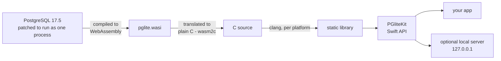

# pglite-ios — a real Postgres database inside your iOS app

Put a genuine PostgreSQL database inside your iPhone or Mac app. It runs
entirely on the device — no server, no internet connection — and it's
fast: everything is compiled to native code, most queries finish in under
a millisecond, and the database opens in about a third of a second. It
also includes [pgvector](https://github.com/pgvector/pgvector), so you can
do similarity search over AI embeddings locally.

This is not a SQLite lookalike. It's PostgreSQL 17.5 itself — the same
query engine, the same SQL, the same transactions and crash recovery you
get from a hosted Postgres. If your app talks to Postgres in the cloud,
the local database behaves the same way. Size cost: about 8 MB on your
app's download, about 27 MB on disk once installed (Postgres is a big
program); RAM while running is typically 25–40 MB (see Memory below).
iOS 15+ and macOS 13+, App Store compatible.

**Credit where due:** this builds on
[PGlite](https://github.com/electric-sql/pglite) by
[ElectricSQL](https://electric-sql.com), which reworked PostgreSQL to run
as a single process ([@pmp-p](https://github.com/pmp-p) pioneered the
variant we use), and on [wasipg](https://github.com/moznion/wasipg) by
[@moznion](https://github.com/moznion), which made that variant solid and
reproducible. This repository adds the iOS build pipeline, pgvector, and
the Swift API — **built by Anthropic's Claude (Fable)**. Licenses in
[NOTICE](NOTICE).

## Using it

```swift
import PGliteKit

let db = try PGliteDatabase(root: sandboxDir)   // opens in ~0.3 s
try await db.execute("CREATE EXTENSION IF NOT EXISTS vector")
try await db.execute("CREATE TABLE items (id serial, e vector(3))")
try await db.execute("INSERT INTO items (e) VALUES ($1::vector)",
                     [.vector([1, 2, 3])])
let r = try await db.execute(
    "SELECT id FROM items ORDER BY e <-> $1::vector LIMIT 1",
    [.vector([1, 2, 3])])
r.rows[0].int("id")   // 1
try await db.withTransaction { db in
    try await db.execute("UPDATE items SET e = $1::vector WHERE id = $2",
                         [.vector([9, 9, 9]), .int(1)])
}
```

Everything works the way Postgres normally works: transactions,
parameterized queries with typed values
(`.int/.string/.double/.bool/.bytes/.uuid/.date/.vector`), error codes
(SQLSTATE) — and a failed query never takes the database down. Vector
indexes (HNSW, IVFFlat) work. The test suite passes on macOS, the iOS
simulator, and physical iPhones.

## Adding it to your app

1. In Xcode: **File → Add Package Dependencies…**, paste this repo's URL,
   and pin a release tag.
2. Add `PGliteKit` to your target and `import PGliteKit`.
3. Pick a folder in your app's sandbox (Application Support is the usual
   choice) and create `PGliteDatabase(root:)` once at startup. The first
   launch sets up the data directory; later launches just reopen it.
4. Keep that one instance and run all queries through it — it's one
   database connection, and the type is an actor so it's safe to use from
   async Swift. Calling `close()` on the way out is polite but optional:
   if the app is killed, Postgres's crash recovery brings the data back
   intact on the next open.

Building from a fresh clone instead of a release: `brew install wabt`,
then `make xcframework && swift test`.

### Where your data lives

Everything is stored under the `root:` folder you pass to
`PGliteDatabase` — the database files themselves end up at
`<root>/tmp/pglite/base/`. (That `tmp/pglite` is the engine's internal
layout, not iOS's temp directory — on disk it's just subfolders of your
chosen root.)

```swift
let root = FileManager.default.urls(
    for: .applicationSupportDirectory, in: .userDomainMask)[0]
    .appendingPathComponent("db")
let db = try PGliteDatabase(root: root)
```

- Use **Application Support**, as above. Never put the root in `tmp/` or
  `Caches/` — iOS purges those, taking your database with them.
- Application Support is included in iCloud/device backups by default.
  If your local database is just a re-syncable mirror of a server, set
  `isExcludedFromBackup` on the root URL to keep backups slim.
- Files inherit iOS's standard at-rest encryption (data protection).

## Letting other things connect (the connection string)

Normally your Swift code calls the database directly. But you can also
turn on a tiny local server so anything that speaks the Postgres protocol
— a webview, a JavaScript runtime, the same driver code you use against
your hosted Postgres — can connect with an ordinary connection string:

```swift
let server = PGliteServer(db: db)   // random password, new every launch
try server.start()                  // random port on 127.0.0.1
server.connectionString
// postgresql://postgres:<random>@127.0.0.1:<port>/template1
```

**Whoever has the connection string can connect; nobody else can.** On
iOS, `127.0.0.1` is shared by every app on the device, so the port itself
is not protection — the password is. The server checks it before the
database sees anything, the password is random on every launch, and it
only exists in memory. Hand the string to the one consumer you intend
(e.g. inject it into your webview) and that's the whole security model.
One client at a time; use `sslmode=disable` (it's loopback, there's no
network).

## Memory

The database keeps all of its working memory in one block that grows as
needed but never shrinks until the app restarts. Day-to-day use sits
around 25–40 MB. A huge sort or a big vector-index build can push that up
and it stays up — which matters on older iPhones, where the OS kills
memory-hungry apps. Rules of thumb: don't run enormous one-shot
operations casually, and if you do (or you get a memory warning), close
and reopen the database — that's ~0.3 s and releases everything. A
configurable memory cap is on the roadmap.

## Performance

- Compiled to native code ahead of time — no interpreter, no JIT. Around
  6–7× faster than running the same engine in a JavaScript runtime.
- Opens in ~0.3 s. Simple queries take well under a millisecond on
  recent iPhones; an entire 10-statement test case, including opening the
  database, runs in ~0.8 s on an iPhone 17 Pro.
- Queries pass through shared memory — no sockets or files per query.
  Writes are durable the same way Postgres is always durable (write-ahead
  log + fsync).
- Size: ~20 MB of installed machine code + ~7 MB of data files. Because
  the code compresses well, the App Store download grows by only ~8 MB.

## Repository layout

| path | contents |
|---|---|
| `Sources/`, `Tests/`, `Package.swift` | the Swift package (`PGliteKit`) |
| `module/` | rebuilds the PostgreSQL engine from pinned sources + our patches (Docker) |
| `native/` | turns the engine into iOS/macOS static libraries, plus the C glue and tests |
| `examples/DeviceHost/` | small host app for running the test suite on a physical device |
| `docs/` | the feasibility and engineering reports behind this project |

## Building everything from source

```sh
brew install wabt xcodegen        # build tools
./module/build.sh                 # 1. rebuild the engine (Docker, ~4 min)
make xcframework                  # 2. compile it for iOS device + simulator + macOS
make resources                    # 3. refresh the package's bundled data files
make test                         # 4. run the C and Swift test suites
```

Steps 1 and 3 only matter when the engine itself changes; day-to-day
Swift work needs `make xcframework` once, then plain `swift test`.

Device run: `cd examples/DeviceHost && xcodegen generate && xcodebuild test
-project PGliteHost.xcodeproj -scheme PGliteHost -destination
'platform=iOS,id=<udid>' -allowProvisioningUpdates` (set your own
`DEVELOPMENT_TEAM` in `project.yml`).

## How it works

PostgreSQL can't normally run on iOS: it forks processes, and iOS forbids
that (and forbids just-in-time compilation, which rules out ordinary
WebAssembly runtimes too). The path around both restrictions:



- ElectricSQL's patched PostgreSQL compiles to WebAssembly; wasm2c
  translates that module into plain C; clang compiles the C for each
  Apple platform. The result is an ordinary static library — no runtime,
  no interpreter.
- Every ingredient is pinned to an exact version and checksum in
  `module/versions.env`, and our changes are small reviewable patch files
  in `module/patches/` — so the whole engine rebuilds bit-for-bit
  reproducibly.
- Your data lives under the folder you choose; within a PostgreSQL major
  version the storage format is stable, so app updates just reopen the
  same data. Moving to a future major version (Postgres 18+) will ship
  with a one-time migration when it's needed.

## License

MIT for this repository's original code. PostgreSQL, pgvector, wasipg and
wabt components under their own licenses — see [NOTICE](NOTICE). Built
bundles embed PostgreSQL's COPYRIGHT as required by its license.
