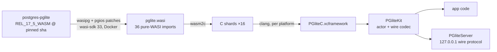

# pglite-ios — real PostgreSQL, embedded in your iOS app

**What this is:** full PostgreSQL 17.5 — the actual parser, planner,
executor, WAL, and MVCC engine, not a SQLite wrapper — plus
[pgvector](https://github.com/pgvector/pgvector) 0.8.0, compiled to native
arm64 code and linked into your app as a Swift package (`PGliteKit`). Your
app gets a persistent, transactional, crash-recovering Postgres database
that works fully offline, with vector similarity search built in. No
server process, no JIT, App Store compatible. iOS 15+ and macOS 13+.

**Whose work this leverages:** this project is a thin native layer on the
shoulders of others. [PGlite](https://github.com/electric-sql/pglite) by
[ElectricSQL](https://electric-sql.com) (with the WASI flavor pioneered by
[@pmp-p](https://github.com/pmp-p)) patched PostgreSQL to run as a
single-process WebAssembly engine. [wasipg](https://github.com/moznion/wasipg)
by [@moznion](https://github.com/moznion) made the WASI build production-shaped
— real error recovery via wasm exception handling, reproducible pinned
builds. [wabt](https://github.com/WebAssembly/wabt)'s wasm2c turns the
wasm module into plain C we compile for iOS. PostgreSQL itself is the
PostgreSQL Global Development Group's. See [NOTICE](NOTICE) for licenses.
This repository adds the pgvector static linking, the wasm2c/iOS build
pipeline, a WASI→POSIX shim, and the Swift API — **built by Anthropic's
Claude (Fable)**.

## Using it

```swift
import PGliteKit

let db = try PGliteDatabase(root: sandboxDir)   // first boot seeds a
                                                // pristine PGDATA (~0.3 s)
try await db.execute("CREATE EXTENSION IF NOT EXISTS vector")
try await db.execute("CREATE TABLE items (id serial, e vector(3))")
try await db.execute("INSERT INTO items (e) VALUES ($1::vector)",
                     [.vector([1, 2, 3])])
let r = try await db.execute(
    "SELECT id FROM items ORDER BY e <-> $1::vector LIMIT 1",
    [.vector([1, 2, 3])])
r.rows[0].int("id")   // 1
try await db.withTransaction { db in
    try await db.execute("UPDATE items SET e = $1::vector WHERE id = $2",
                         [.vector([9, 9, 9]), .int(1)])
}
```

Real Postgres semantics throughout: transactions, SQLSTATE-mapped errors
that never kill the engine, extended protocol with typed parameters
(`.int/.string/.double/.bool/.bytes/.uuid/.date/.vector`), HNSW/IVFFlat
vector indexes, and WAL crash recovery — the suite passes on macOS, the
iOS simulator, and physical iPhone hardware.

## Adding it to your iOS app

1. In Xcode: **File → Add Package Dependencies…** and enter this repo's
   URL (or add it to `Package.swift` dependencies). Pin a release tag.
2. Add `PGliteKit` to your target, `import PGliteKit`.
3. Pick a directory in your sandbox (e.g.
   `FileManager.default.urls(for: .applicationSupportDirectory, …)` +
   `"db"`) and create `PGliteDatabase(root:)` once, at startup. First
   launch seeds the data directory; later launches resume it.
4. Treat it as one connection: keep the instance in one place (it's an
   actor), and call `close()` on the way out of the app if you want a
   clean checkpoint (data survives regardless — WAL recovery handles
   force-quits).

Building from a fresh clone instead of a release: `brew install wabt`,
then `make xcframework && swift test` (release tags ship the prebuilt
xcframework as an asset so consumers skip this).

## The localhost connection string

`PGliteServer` optionally exposes the engine as a real PostgreSQL server
on `127.0.0.1`, so anything that speaks the Postgres wire protocol — a
webview bridge, a JS runtime, PostgresNIO/libpq code that also talks to
your hosted Postgres — can connect with an ordinary connection string:

```swift
let server = PGliteServer(db: db)   // random 72-char password per launch
try server.start()                  // random ephemeral port
server.connectionString
// postgresql://postgres:<random>@127.0.0.1:<port>/template1
```

**The connection string is the capability.** iOS loopback is
device-global — any app on the device can reach an open port — so the
server verifies the MD5 handshake host-side (constant-time) before a
single byte reaches the engine. Hand the string only to the consumer you
intend; without it, connections are rejected. One client at a time; all
clients share the single backend session with the app's own queries;
`sslmode=disable` (it's loopback).

## Memory

The engine lives in one 32-bit wasm linear memory: ~25 MB at boot, grows
on demand — and, like any wasm memory, **never shrinks until the process
restarts**. A large sort or HNSW index build permanently raises the
footprint, which matters under iOS memory pressure (jetsam). Practical
guidance today: keep `work_mem`/`maintenance_work_mem` modest (SET them
for big index builds), avoid gratuitous multi-hundred-MB operations on
old devices, and recycle the instance (`close()` + reopen, ~0.3 s) after
heavy maintenance or on memory warnings. A configurable hard cap is on
the roadmap.

## Performance

- Ahead-of-time compiled native code — no interpreter, no JIT. The full
  test suite (boot + DDL + DML + vector KNN + HNSW build) runs ~6–7×
  faster than the same wasm module under Node/V8.
- First boot ~0.3 s (pristine seed, no initdb); resume boots similar.
  Simple queries run in the sub-millisecond-to-millisecond range on
  M-series and recent iPhones (~0.8 s for an entire 10-statement test
  case on an iPhone 17 Pro, boot included).
- Queries travel over an in-memory channel — zero file/socket I/O per
  query. Durability is Postgres WAL + `fsync`.
- Cost: ~21 MB added binary, ~7 MB resources. On physical devices the
  build uses explicit bounds checks (the fastest wasm2c mode aborts on
  iOS hardware); at app workloads the difference is not perceptible.

## Repository layout

| path | contents |
|---|---|
| `Sources/`, `Tests/`, `Package.swift` | the Swift package (`PGliteKit`) |
| `module/` | reproducible Docker build of `pglite.wasi` from sha-pinned sources + patches |
| `native/` | wasm2c generation, WASI→POSIX shim, C bridge, vendored wasm-rt runtime, native tests |
| `examples/DeviceHost/` | xcodegen host app for running the suite on a physical device |
| `docs/` | feasibility and engineering reports (phases 0–2) |

## Building everything from source

```sh
brew install wabt xcodegen        # wasm2c + example project generation
./module/build.sh                 # 1. pglite.wasi from pinned sources (Docker, ~4 min)
make xcframework                  # 2. wasm2c → static libs → build/PGliteC.xcframework
make resources                    # 3. refresh package resources from the module
make test                         # 4. native C suite + swift test
```

Steps 1 and 3 only matter when the module changes; day-to-day Swift work
needs `make xcframework` once, then plain `swift test`.

Device run: `cd examples/DeviceHost && xcodegen generate && xcodebuild test
-project PGliteHost.xcodeproj -scheme PGliteHost -destination
'platform=iOS,id=<udid>' -allowProvisioningUpdates` (set your own
`DEVELOPMENT_TEAM` in `project.yml`).

## How it works



- Single connection, single-threaded, actor-isolated.
- Postgres ERROR recovery works via setjmp/longjmp lowered onto the
  standardized wasm exception-handling proposal, carried through wasm2c.
- On-device data lives under the root directory you choose
  (`<root>/tmp/pglite/base`); within a PostgreSQL major version the
  on-disk format is stable — app updates just reopen the same data.

## Dependency + update policy

- Every input is pinned by commit/sha256 in `module/versions.env`; local
  changes are reviewable patch files (`module/patches/`), not a fork.
- PG 17 is supported upstream until ~2029. A future PG 18 module requires
  porting the WASI flavor to the newer branch plus a one-time
  dump/restore data migration, shipped with whichever release needs it.

## License

MIT for this repository's original code. PostgreSQL, pgvector, wasipg and
wabt components under their own licenses — see [NOTICE](NOTICE). Built
bundles embed PostgreSQL's COPYRIGHT as required by its license.
